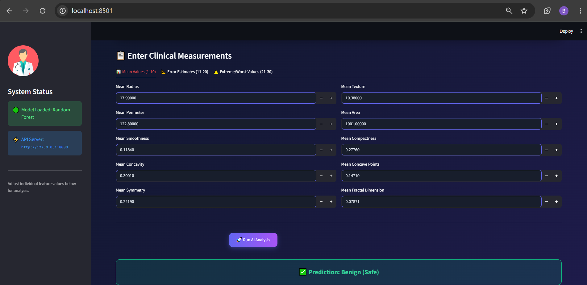

# Breast Cancer Dataset App

## How to Run

1. Clone the repository:
   git clone https://github.com/beenishtech/Breast_cancer_dataset.git

2. Install dependencies:
   pip install streamlit pandas scikit-learn

3. Run the application:
   streamlit run app.py
